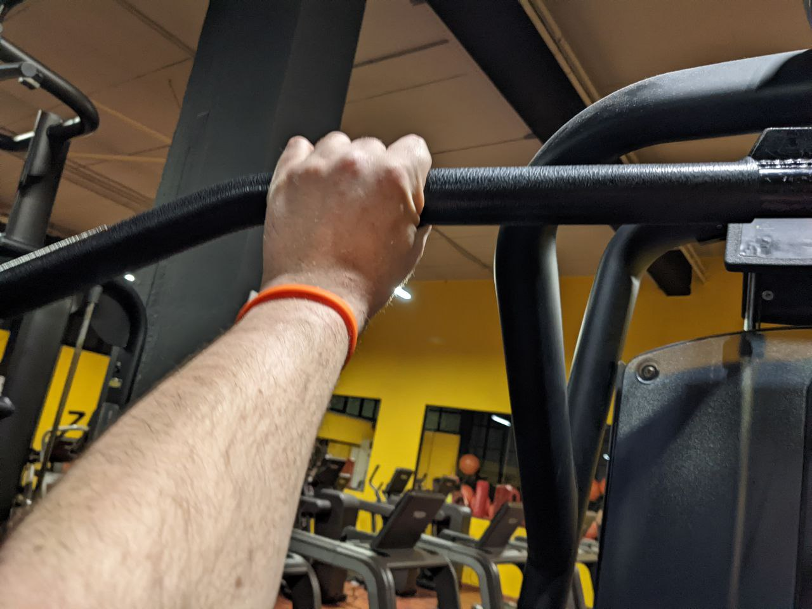
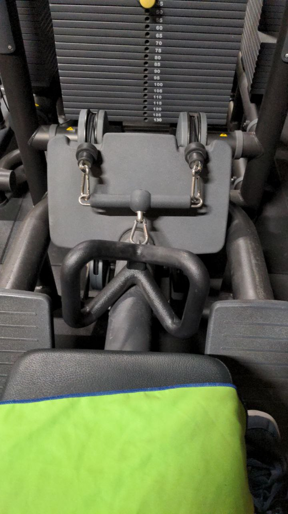
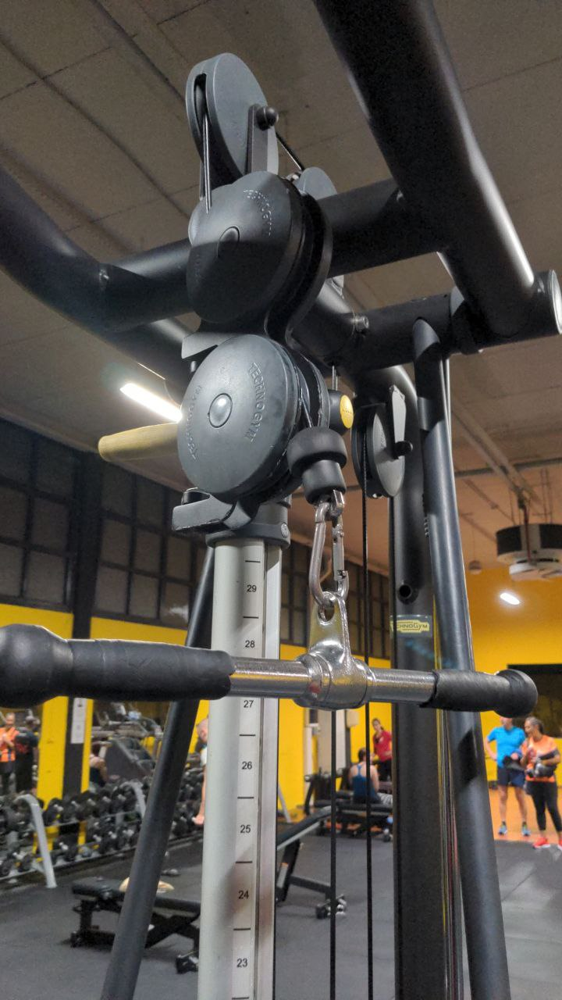

# Allenamento B

## Chest press PURE STRENGTH

Chest press PURE STRENGTH 4x10/12 con 12RM e 1' recupero

| Data       | peso (Kg) |
| ---------- | --------- |
| 2022-02-24 |       15? |
| 2022-03-05 |      22.5 |
| 2022-03-10 |      22.5 |
| 2022-03-24 |        35 |
| 2022-04-07 |        30 |

## Lat machine

Lat machine presa prona 4x10/12 con 12RM e 1' recupero

| Data       | peso (Kg) |
| ---------- | --------- |
| 2022-02-24 |        35 |
| 2022-03-05 |        30 |
| 2022-03-10 |        35 |
| 2022-03-24 |        40 |
| 2022-04-07 |        35 |

I gomiti si tengono in avanti.

La presa "prona" significa che la mano è sopra il manubrio.

## Panca piana

Panca piana 4x6 con 6RM con 1'30'' recupero

| Data       | peso (Kg) |
| ---------- | --------- |
| 2022-02-24 |        18 |
| 2022-03-05 |        20 |
| 2022-03-10 |        20 |
| 2022-03-24 |      22.5 |
| 2022-04-07 |        20 |

## Pulley

Pulley 4x6 con 6RM con 1'30'' recupero

| Data       | peso (Kg) |
| ---------- | --------- |
| 2022-02-24 |        40 |
| 2022-03-05 |        35 |
| 2022-03-10 |        35 |
| 2022-03-24 |        45 |
| 2022-04-07 |        45 |

Il busto rimane dritto, tirare l'attrezzo all'altezza dello stomaco.

## Push up

Push up 3 x max con 1' recupero

## Pulldown

Pulldown 3x15 con 30'' recupero

| Data       | peso (Kg) |
| ---------- | --------- |
| 2022-02-24 |        10 |
| 2022-03-05 |        11 |
| 2022-03-10 |        11 |
| 2022-03-24 |      12.5 |
| 2022-04-07 |        12 |

Il movimento viene fatto tenendo fermi i gomiti.

Braccio disteso, dorso della mano sopra l'attrezzo

## Camminata in salita

Camminata in salita 20', pendenza 15, velocità 5/6.