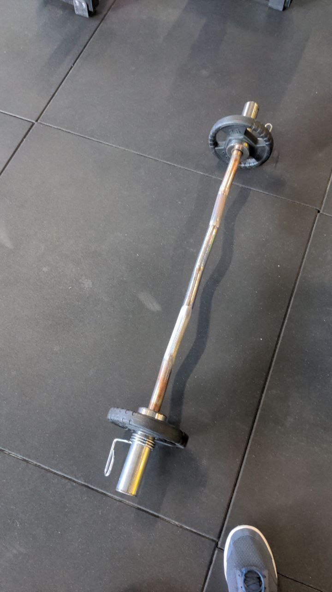
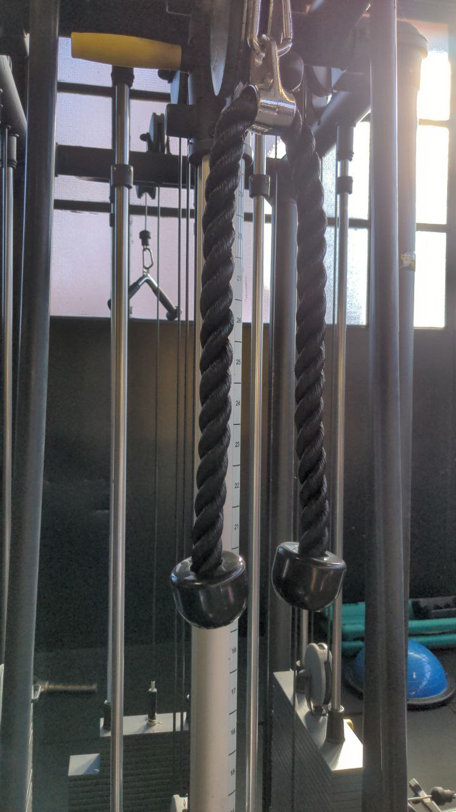

# 2022-02 - C

[[toc]]

## Shoulder press PURE STRENGTH

Shoulder press PURE STRENGTH 4x10/12 con 12RM e 1' recupero

| Data       | peso (Kg) |
| ---------- | --------- |
| 2022-02-26 |        25 |
| 2022-03-12 |      27.5 |
| 2022-03-19 |        30 |
| 2022-04-09 |        30 |

Tenere i gomiti in avanti.

Il movimento parte con i gomiti a 90°, salendo finché il braccio non è totalmente disteso.

## Leg extension

Leg extension singola 3x12 con 15RM e 1' recupero

| Data       | peso (Kg) |
| ---------- | --------- |
| 2022-02-26 |      12.5 |
| 2022-03-12 |      17.5 |
| 2022-03-19 |      17.5 |
| 2022-04-09 |      17.5 |

Nota che è 12 con 15RM: non devi andare a cedimento.

Fai entrambe le gambe, quindi 1' di recupero.

Rimani giù 1'' quando scendi.

## Lat machine

Lat machine con trazy bar 4x10/12 con 12RM e 1' recupero

| Data       | peso (Kg) |
| ---------- | --------- |
| 2022-02-26 |        35 |
| 2022-03-12 |        35 |
| 2022-03-19 |        40 |
| 2022-04-09 |        40 |

Se hai fastidio al fianco, metti le ginocchia sopra il poggiolo.

L'attrezzo da usare è quello dritto coi manici laterali in metallo.

Gomiti in avanti, la presa è parallela al pavimento.

Petto in fuori, quando la sbarra scende valle in contro col petto

## Curl con bilancere

Curl con bilancere con appoggio a parete 4'' di eccentrica 4x10 con 10RM e 1' recupero

| Data       | peso (Kg) |
| ---------- | --------- |
| 2022-02-26 |        10 |
| 2022-03-12 |         5 |
| 2022-03-19 |         5 |
| 2022-04-09 |         |

Posizionati contro una superficie d'appoggio, sia schiena che culo contro il muro.

Partendo con le braccia distese, salire fino al mento ruotando sul gomito.

Il movimento non è solo rotazione del gomito ma, salendo, si alza anche il gomito, allontanandolo dal busto.

Quando scendi il braccio si distende tutto e, avendolo allontanato dal corpo in salita, non devi toccare la gamba.

## Pushdown

Pushdown con corda 2''iso a 4x10 con 10RM e 1' recupero

| Data       | peso (Kg) |
| ---------- | --------- |
| 2022-02-26 |        10 |
| 2022-03-12 |        12 |
| 2022-03-19 |        13 |
| 2022-04-09 |         |

Schiena e spalle chiuse, petto in fuori. __è facile perdere la postura, facci attenzione, in particolare al petto__

Se serve, puoi piegare un po' le ginocchia.

Piega in avanti il busto.

Scendendo, il gomito tiene la posizione e si muove solo l'avambraccio.

Immagina non di tirare la corda verso di te ma di portarla verso i piedi.

Una volta sceso, le mani si allargano lungo i fianchi. Mantieni la posizione 2s, quindi risali.

Quando risali scendi subito, non fare pause.

## Russian Twist + Hyperextension

Russian twist x 30 totali + Hyperextension x 12, 4 giri con 1' di recupero

### Russian Twist

Sul tappetino, seduto a pancia in su, tenersi in equilibrio sul culo.

Eseguire delle torsioni del torso/busto a dx/sx.

Segui con gli occhi la torsione.

### Hyperextension

Lo strumento è quello accanto i tappetini.

Incastrare le gambe e partire da una posizione con busto in linea con le gambe.

Tenere le braccia incrociate sul petto.

Scendere col busto il più possibile, quindi salire lentamente.

## Camminata in salita

Camminata in salita 20', pendenza 15, velocità 5/6.