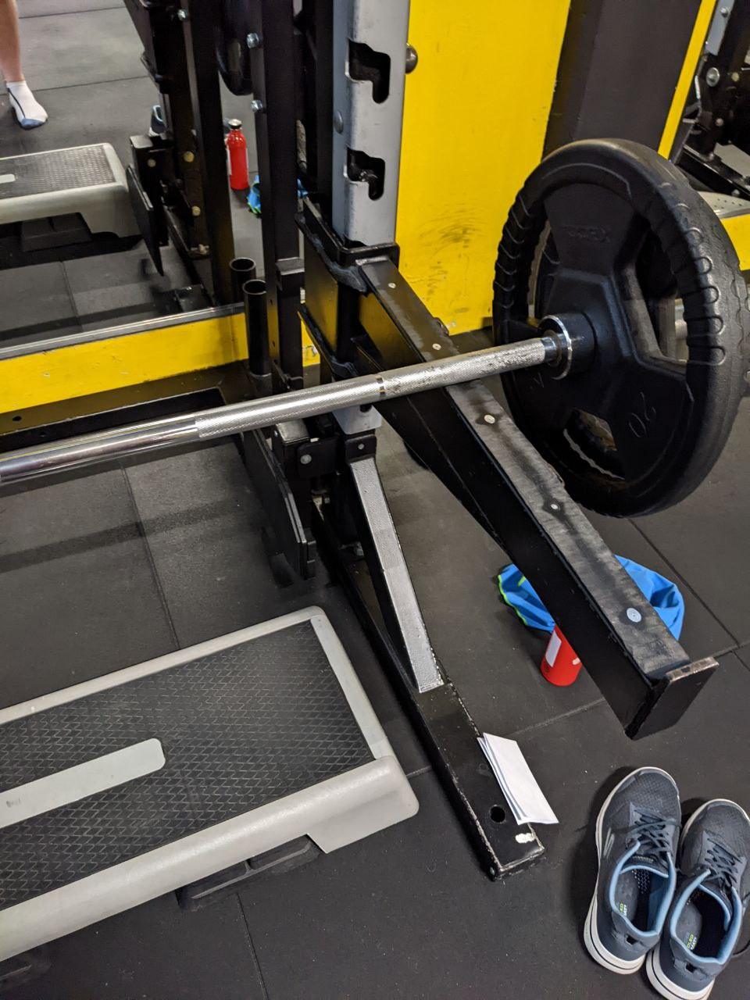
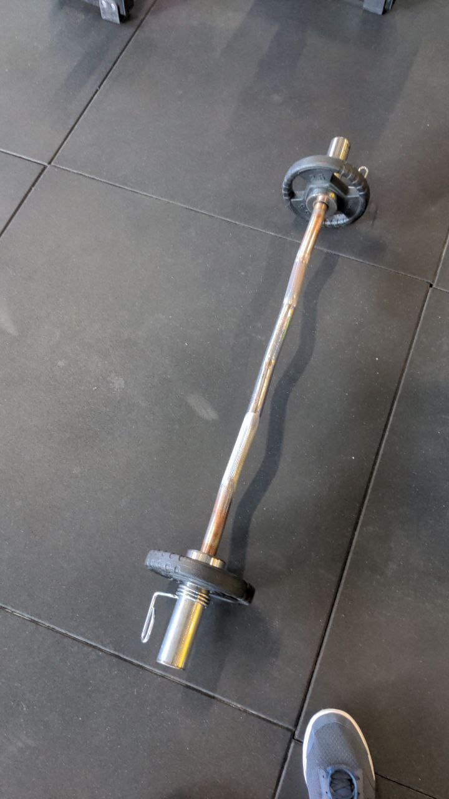

# Allenamento B

## Mezzo stacco

Mezzo stacco 6x6 con 6RM e recupero di 1'30''

| Data       | peso*(Kg) |
| ---------- | --------- |
| 2022-05-03 |        60 |
| 2022-05-12 |        60 |
| 2022-05-21 |    70\*\* |
| 2022-06-01 |        50 |
| 2022-06-29 |        50 |

\* più 20Kg barra

\*\* esercizio fatto con grip e cintura

L'esercizio si fa sull'aggeggio dove fai gli squat.

Le ginocchia non si piegano molto, butta indietro il culo.

Addome in tensione, schiena dritta, spalle chiuse.

La presa è a circa 1 pollice di distanza dalla riga.

Alza il bilanciere spingendo con le gambe, non devi piegare le braccia o alzare le spalle.

## Shoulder press PURE

Shoulder press PURE 5x12 con 12RM e recupero di 1'

| Data       | peso (Kg) |
| ---------- | --------- |
| 2022-05-03 |        35 |
| 2022-05-12 |        35 |
| 2022-05-21 |        40 |
| 2022-06-01 |        40 |
| 2022-06-29 |        40 |

## Alzate laterali

Alzate laterali 3x12 con 12RM e recupero di 1'

| Data       | peso (Kg) |
| ---------- | --------- |
| 2022-05-03 |         8 |
| 2022-05-12 |         8 |
| 2022-05-21 |         8 |
| 2022-06-01 |         8 |
| 2022-06-29 |         8 |

Posizionati in piedi.

Parti con le braccia a una spanna dal corpo, alzale lateralmente in modo da arrivare con una presa "a manubrio di moto" a 45°.

Importante: non devi alzare gli avambracci quando non ce la fai più, l'esercizio si fa col braccio.

## Tirate allo sterno

Tirate allo sterno con bilanciere EZ 3x12 con 12RM e recupero di 1'

| Data       | peso (Kg) |
| ---------- | --------- |
| 2022-05-03 |        10 |
| 2022-05-12 |        10 |
| 2022-05-21 |        10 |
| 2022-06-01 |        10 |
| 2022-06-29 |        10 |

Stando in piedi, parti col bilanciere all'altezza della pancia.

Spalle chiuse, schiena dritta, addome tirato.

Alza il bilanciere fino al petto, gomiti in avanti.

Tenendo i gomiti in avanti, potresti perdere la posizione delle spalle. Cerca comunque di tenerle giù.

## Zottman curl + French press

Zottman Curl x 10 con 10RM + 30'' + French press con manubri TUT 2040 x 10 con 10RM, 4 giri con recupero di 1'.

| Data       | Zottman (Kg) | French (Kg) |
| ---------- | ------------ | ----------- |
| 2022-05-03 |           12 |          12 |
| 2022-05-12 |           12 |          12 !
| 2022-05-21 |           12 |          12 !
| 2022-06-01 |           12 |          12 !
| 2022-06-29 |           12 |          12 !

### Zottman curl

Stando in piedi, un peso per mano, schiena dritta e spalle chiuse.

1. Braccia distese lungo i fianchi, presa a martello (tipo borse della spesa)
2. Piegando i gomiti, porta i pesi alla testa e, salendo, porta avanti i gomiti all'altezza delle tette.
3. Arrivato in cima gira le mani di 90°, puntando le unghie verso la faccia.
4. Scendi, tornando alla posizione lungo i fianchi.
5. Torna con la posizione a martello e ripeti.

### French press

Panca piana, inizia l'esercizio con le braccia distese verso l'alto.

Scendi con gli avambracci fino alla testa, piegando i gomiti, 4 secondi a scendere, 2 a salire.

I gomiti rimangono sempre all'altezza delle spalle, non del petto.

## Crunch + Russian Twist + Plank x 3

Crunch x 20 +  Russian twist x 30 + Plan x max

### Crunch

Sul tappetino, da disteso, fissa un punto sul soffitto, alza le spalle da terra.

### Russian Twist

Sul tappetino, seduto a pancia in su, tenersi in equilibrio sul culo.

Eseguire delle torsioni del torso/busto a dx/sx.

Segui con gli occhi la torsione.

### Plank

Sul tappetino, appoggiati sui gomiti e sulle punta dei piedi, corpo dritto, tira l'addome.

Mantieni la posizione finché riesci.