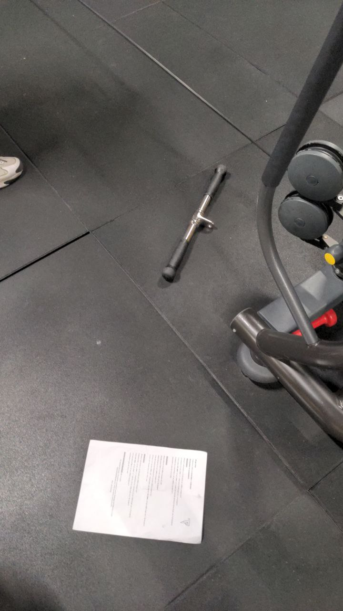

# Allenamento C

## Affondi in camminata

Affondi in camminata 3 x 10 (20 passi) con 10RM e recupero di 1'

| Data       | peso (Kg) |
| ---------- | --------- |
| 2022-05-04 |        20 |
| 2022-05-15 |        20 |
| 2022-05-26 |        20 |
| 2022-07-01 |        20 |

Se non riesci a farli, un esercizio per calare il dolore è:

Da disteso, tiri il ginocchio verso il petto e rimani in posizione 30''.

Al secondo giro, allarghi un po' la gamba (30-40°).

## Pulldown PURE + Distensioni p. inclinata

Pulldown PURE x 12 con 12RM + 1' + Distensioni su panca inclinata x 12 con 12RM (6 giri con recupero di 1')

| Data       | Pulldown (Kg) | P. Inclinata (Kg) |
| ---------- | ------------- | ----------------- |
| 2022-05-04 |            50 |               20? |
| 2022-05-15 |            40 |                20 |
| 2022-05-26 |            40 |                20 |
| 2022-07-01 |            50 |                20 |

### Pulldown PURE

L'attrezzo è nella sala sopra, l'ultimo in fondo a destra.

Il movimento è simile a quello della lat machine: parti con le braccia distese, le attivi, quindi tiri.

Il gomito rimane sempre in avanti.

### Distensioni Panca Inclinata

Panca a 30°.

Manubri ad altezza del petto, tenuti a 45°. Salendo devono rimanere ad altezza del petto, non delle spalle.

Cerca di distendere tutto il braccio quando sali.

## Pulley + Delt fly

Pulley TUT 2042 x 10 con 10RM + 1' + Delt fly x 10 con 10RM (4 giri con recupero di 1')

| Data       | Pulley (Kg) | Delt fly (Kg) |
| ---------- | ----------- | ------------- |
| 2022-05-04 |         30? |             4 |
| 2022-05-15 |          30 |             6 |
| 2022-05-26 |          30 |             6 |
| 2022-07-01 |          30 |             6 |

### Pulley 2042

- 2 secondi a tirare
- 4 secondi a scendere
- 2 secondi giù in tensione

l'attrezzo è quello plasticoso triangolare.

Tira verso l'ombelico.

Quando scendi, distendi tutto.

Quando sali, rimetti in posizione le spalle, quindi tira.

### Delt fly

Sulla panca, seduto e piegato in avanti.

Le braccia salgono, non lateralmente ma in diagonale in avanti.

Non tirare il collo mentre fai l'esercizio.

Chiudi spalle, scapole, etc.

Se non ce la fai a salire, non forzare, arrivi dove arrivi.

## Curl cavo basso

Curl cavo basso 2'' iso x 10 con 10RM e recupero di 1'

| Data       | peso (Kg) |
| ---------- | --------- |
| 2022-05-04 |       7.5 |
| 2022-05-15 |        10 |
| 2022-05-26 |        10 |
| 2022-07-01 |        10 |

Unghie rivolte verso la faccia.

Parti col braccio disteso, sali piegando il gomito.

Arrivi con l'attrezzo all'altezza del viso e, mentre sali, porti in avanti i gomiti.

Una volta in cima - mantenendo la tensione - tieni la posizione 2 secondi.

Gambe un minimo piegate, schiena in posizione e culo un minimo indietro.

## Camminata in salita

Camminata in salita 30', pendenza 15, velocità 5.