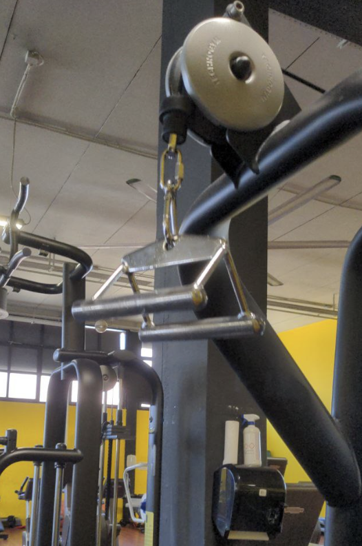

# 2022-07 - C

[[toc]]

## Incline leg press da PIN

Incline leg press da PIN (3/4 ROM), 1' recupero e rispettivo RM

| Data       | Target | peso (Kg) |
| ---------- | ------ | --------- |
| 2022-07-09 |   3x20 |        60 |
| 2022-07-16 |   4x20 |        70 |
| 2022-08-09 |   3x15 |        80 |
| 2022-08-23 |   4x15 |       100 |
| 2022-09-03 |   3x12 |       110 |
| 2022-09-22 |   4x12 |       100 |
| 2022-09-30 |   4x12 |       130 |
| 2022-10-17 |   4x12 |       120 |

## Shoulder press PURE

Shoulder press PURE STRENGTH, 1' recupero

| Data       | Target | peso (Kg) |
| ---------- | ------ | --------- |
| 2022-07-09 |   3x20 |      17.5 |
| 2022-07-16 |   4x20 |      17.5 |
| 2022-08-09 |   3x15 |        25 |
| 2022-08-23 |   4x15 |        25 |
| 2022-09-03 |   3x12 |        30 |
| 2022-09-22 |   4x12 |        30 |
| 2022-09-30 |   4x12 |        40 |
| 2022-10-17 |   4x12 |        40 |

## Lat Machine triangolo

Lat Machine triangolo, 1' recupero e rispettivo RM

| Data       | Target | peso (Kg) |
| ---------- | ------ | --------- |
| 2022-07-09 |   3x20 |        30 |
| 2022-07-16 |   4x20 |        30 |
| 2022-08-09 |   3x15 |        30 |
| 2022-08-23 |   4x15 |        30 |
| 2022-09-03 |   3x12 |        35 |
| 2022-09-22 |   4x12 |        35 |
| 2022-09-30 |   4x12 |        35 |
| 2022-10-17 |   4x12 |        40 |

Ginocchia sopra l'appoggio

## Mountain climber

Mountain climber 4x30'' con 1' recupero

## Leg curl

Leg curl seduto con 1' recupero e rispettivo RM

| Data       | Target | peso (Kg) |
| ---------- | ------ | --------- |
| 2022-07-09 |   3x20 |        30 |
| 2022-07-16 |   4x20 |        25 |
| 2022-08-09 |   3x15 |        30 |
| 2022-08-23 |   4x15 |      32.5 |
| 2022-09-03 |   3x12 |      32.5 |
| 2022-09-22 |   4x12 |        35 |
| 2022-09-30 |   4x12 |        35 |
| 2022-10-17 |   4x12 |        35 |

Tira con la parte alta della gamba, dietro al ginocchio. Non tirare con la caviglia.

## Camminata in salita

Camminata in salita 20', pendenza 15, velocità 5.