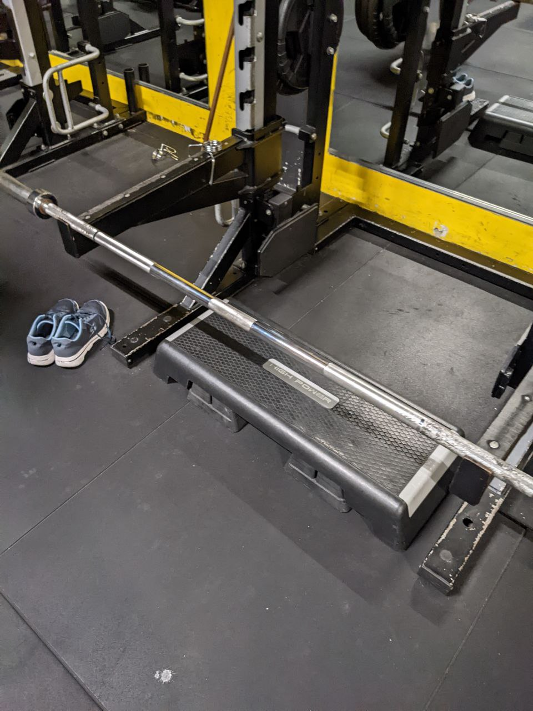
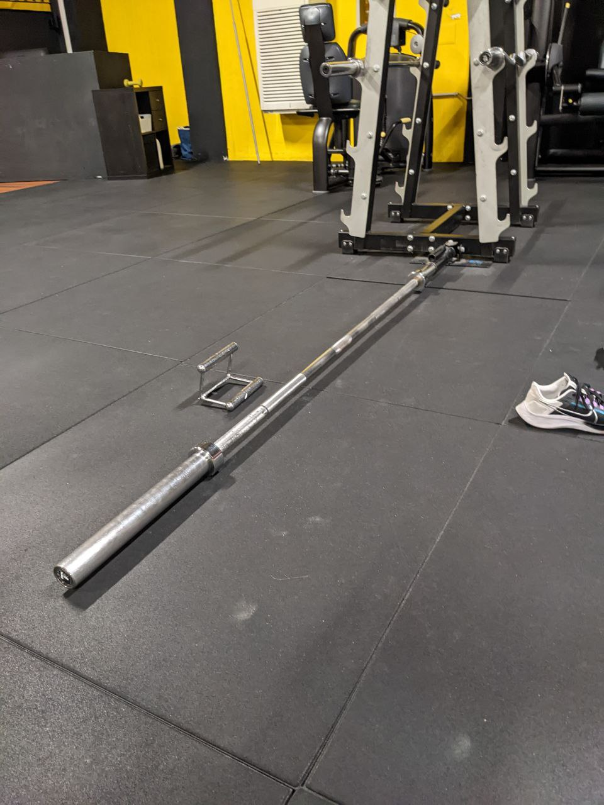

# Allenamento A

[[toc]]

Range cedimento consentito -1 o -2 

## Panca piana da PIN

| Sett. | Data       | Target | Recupero | RM  | peso (Kg) |
| ----- | ------- | ------ | -------- | --- | --------- |
| 1 | 2022-10-20 |    3x2 | 2'       | 5RM |        20 |
| 2 | 2022-10-27 |    4x3 | 2'       | 5RM |        25 |
| 3 | 2022-11-15 |    4x4 | 2'       | 5RM |    22.5\* |
| 4 | 2022-11-22 |    5x3 | 1'30''   | 5RM |        20 |
| 4 | 2022-11-29 |    5x3 | 1'30''   | 5RM |        20 |
| 5 | 2022-12-07 |    6x3 | 1'30''   | 5RM | 20 :material-trending-up: |
| 6 | 2022-12-17 |    7x3 | 1'30''   | 5RM |        30 |
| 7 | 2022-12-23 |    5x4 | 2'       | 5RM |        30 |
| 8 | 2023-01-02 |    5x5 | 2'       | 5RM |        30 |
| 8 | 2023-01-10 |    5x5 | 2'       | 5RM |        30 |

\* rimani a 20.

Col PIN la barra arriva a circa 5-10cm dal petto.

Posizionati nel RACK, non sulle panche normali.

__Spalle giù (ricorda esercizio con gli elastici sotto le ascelle).__

Scapole chiuse.

Gomito in linea col bilanciere, bilanciere poco sopra i capezzoli. La barra rimane sempre a quell'altezza.

Una volta in posizione, spingi senza salire - così da attivare il petto - quindi sali.

Ricorda di attivare il petto.

Presa delle mani abbastanza ampia, l'indice sta circa a 4-5 dita di distanza dalla tetta.

Se l'asta ce l'ha, posiziona il mignolo sul primo anello.

## Chest press PURE

| Sett. | Data       | Target | Recupero | RM   | peso (Kg) |
| ----- | ---------- | ------ | -------- | ---- | --------- |
| 1 | 2022-10-20 |    3x8 | 1'30''   | 10RM |        15 |
| 2 | 2022-10-27 |    4x8 | 1'30''   | 10RM |        25 |
| 3 | 2022-11-15 |   3x10 | 1'       | 12RM |        25 |
| 4 | 2022-11-22 |   3x10 | 1'       | 12RM |        25 |
| 4 | 2022-11-29 |   3x10 | 1'       | 12RM |        25 |
| 5 | 2022-12-07 |    5x8 | 1'30''   | 10RM |        30 |
| 6 | 2022-12-17 |    5x8 | 1'30''   | 10RM |        30 |
| 7 | 2022-12-23 |    6x8 | 1'30''   | 10RM |        30 |
| 8 | 2023-01-02 |    6x6 | 1'30''   |  8RM |        35 |
| 8 | 2023-01-10 |    6x6 | 1'30''   |  8RM |        35 |

__Spalle giù (ricorda esercizio con gli elastici sotto le ascelle).__

Scapole chiuse.

Una volta in posizione, spingi senza salire, quindi sali.

Ricorda di attivare il petto.

## Rematore con bilanciere da PIN con presa inversa

| Sett. | Data       | Target | Recupero | RM   | peso (Kg) |
| ----- | ---------- | ------ | -------- | ---- | --------- |
| 1 | 2022-10-20 |    3x2 | 2'       |  5RM |         ? |
| 2 | 2022-10-27 |    4x3 | 2'       |  5RM |        30 |
| 3 | 2022-11-15 |    4x4 | 2'       |  5RM |        40 |
| 4 | 2022-11-22 |    5x3 | 1'30''   |  5RM |        20 |
| 4 | 2022-11-29 |    5x3 | 1'30''   |  5RM |        30 |
| 5 | 2022-12-07 |    6x3 | 1'30''   |  5RM | 30 :material-trending-up: |
| 6 | 2022-12-17 |    7x3 | 1'30''   |  5RM |        35 |
| 7 | 2022-12-23 |    5x4 | 2'       |  5RM |        35 |
| 8 | 2023-01-02 |    5x5 | 2'       |  5RM |        35 |
| 8 | 2023-01-10 |    5x5 | 2'       |  5RM |        40 |

Da fare scalzo.

Posizionati in piedi davanti l'asta, schieda dritta, culo tirato, gambe dritte.

Butti indietro il culo, tenendo schiena e gambe dritte.

Quando non riesci più a scendere, pieghi le gambe fino a prendere l'aggeggio.

Sali, senza muovere i piedi e senza perdere la posizione.

Presa delle mani con palmi rivolti verso l'alto. Meglio più larga che stretta.

Punti importanti:

- spalle sempre in posizione
- scapole buttate giù
- culo sempre buttato indietro
- schiena sempre dritta
- __culo sempre contratto__
- __il movimento da fare è uno scatto__

## T-bar rowing

| Sett. | Data       | Target | Recupero | RM   | peso (Kg) |
| ----- | ---------- | ------ | -------- | ---- | --------- |
| 1 | 2022-10-20 |    3x8 | 1'30''   | 10RM |        10 |
| 2 | 2022-10-27 |    4x8 | 1'30''   | 10RM |        15 |
| 3 | 2022-11-15 |   3x10 | 1'       | 12RM |        15 |
| 4 | 2022-11-22 |   3x10 | 1'       | 12RM |        15 |
| 4 | 2022-11-29 |   3x10 | 1'       | 12RM |        20 |
| 5 | 2022-12-07 |    5x8 | 1'30''   | 10RM | 25 :material-trending-up: |
| 6 | 2022-12-17 |    5x8 | 1'30''   | 10RM |        35 |
| 7 | 2022-12-23 |    6x8 | 1'30''   | 10RM |        35 |
| 8 | 2023-01-02 |    6x6 | 1'30''   |  8RM |        35 |
| 8 | 2023-01-10 |    6x6 | 1'30''   |  8RM |        35 |

Da fare scalzo.

Posizionati in piedi sopra l'asta, schieda dritta, culo tirato, gambe dritte.

Butti indietro il culo, tenendo schiena e gambe dritte.

Quando non riesci più a scendere, pieghi le gambe fino a prendere l'aggeggio.

Sali, senza muovere i piedi e senza perdere la posizione.

A quel punto parti con l'esercizio: tiri la sbarra verso il petto e scendi.

Sguardo rivolto a terra e puntato su un paio di mattonelle avanti.

mani:

- i pollici vanno tenuti sull'esterno, non chiudono la presa
- tiri con mignolo e anulare

Punti importanti:

- spalle sempre in posizione
- scapole buttate giù
- culo sempre buttato indietro
- schiena sempre dritta
- busto piegato in avanti, abbassati

Compensazioni da controllare:

- piegare la zona lombare per recuperare il peso
- portare avanti il culo (causa piegamento della schiena)

## Alzate laterali stripping

| Sett. | Data       | Target              | Recupero | RM   | peso (Kg) |
| ----- | ---------- | ------------------- | -------- | ---- | --------- |
| 1 | 2022-10-20 |    3x10 + max + max | 1'       | 10RM | 8 + 6 + 4 |
| 2 | 2022-10-27 |    3x10 + max + max | 1'       | 10RM | 8 + 6 + 4 |
| 3 | 2022-11-15 |    3x10 + max + max | 1'       | 10RM | 8 + 6 + 4 |
| 4 | 2022-11-22 |    3x10 + max + max | 1'       | 10RM | 10 + 8 + 6 |
| 4 | 2022-11-29 |    3x10 + max + max | 1'       | 10RM | 10 + 8 + 6 |
| 5 | 2022-12-07 |    3x10 + max + max | 1'       | 10RM | 10 + 8 + 6 |
| 6 | 2022-12-17 |    3x10 + max + max | 1'       | 10RM | 10 + 8 + 6 |
| 7 | 2022-12-23 |    3x10 + max + max | 1'       | 10RM | 10 + 8 + 6 |
| 8 | 2023-01-02 |    3x10 + max + max | 1'       | 10RM | 10 + 8 + 6 |
| 8 | 2023-01-10 |    3x10 + max + max | 1'       | 10RM | 10 + 8 + 6 |

STRIPPING: esegui l'esercizio con 10RM, quindi cali il peso e vai a cedimento, ripeti una seconda volta poi recupero.

Spalle giù, scapole chiuse.

Sali col gomito, non col braccio.

## 3 esercizi per addominali a piacere in sequenza a circuito

3 esercizi per addominali a piacere in sequenza a circuito x 30'' (3 giri con 1’ di recupero)

### Addominali

Con peso da 5kg, braccia distese all'altezza del petto, esegui gli addominali come al solito.

### Russian Twist

### Mountain Climber

### Plank

## Camminata in salita

Camminata in salita 20', pendenza 15, velocità 5.