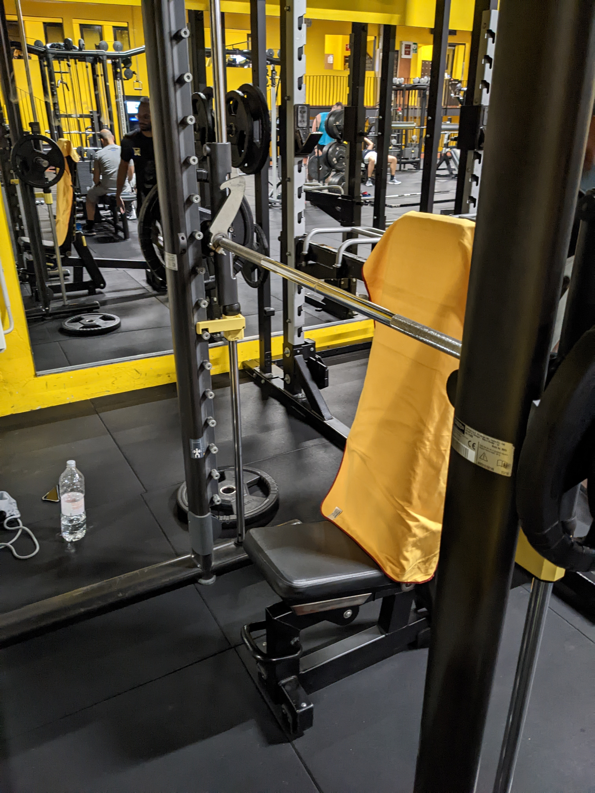

# 2022-10 - C

[[toc]]

Range cedimento consentito -1 o -2 

## Affondi in camminata

| Sett. | Data       | Target | Recupero |  RM  | peso (Kg) |
| ----- | ---------- | ------ | -------- | ---- | --------- |
|     1 | 2022-10-24 |   3x12 | 1'       | 12RM |        32 |
|     2 | 2022-11-03 |   3x12 | 1'       | 12RM |        36 |
|     3 | 2022-11-26 |   3x12 | 1'       | 12RM |        32 |
|     4 | 2022-12-05 |   3x12 | 1'       | 12RM |        32 |
|     5 | 2022-12-11 |   3x12 | 1'       | 12RM |        32 |
|     6 | 2022-12-21 |   3x12 | 1'       | 12RM |        36 |
|     7 | 2022-12-30 |   3x12 | 1'       | 12RM |        32 |
|     8 | 2023-01-07 |   3x12 | 1'       | 12RM |        36 |
|     8 | 2023-01-15 |   3x12 | 1'       | 12RM |        36 |

Se cedi prima di arrivare a 24 passi, cala il peso e continua.

## Leg curl

| Sett. | Data       | Target | Recupero | RM   | peso (Kg) |
| ----- | ---------- | ------ | -------- | ---- | --------- |
|     1 | 2022-10-24 |    3x8 | 1'30''   | 10RM |        30 |
|     2 | 2022-11-03 |    4x8 | 1'30''   | 10RM |        30 |
|     3 | 2022-11-26 |   3x10 | 1'       | 12RM |        25 |
|     4 | 2022-12-05 |   3x10 | 1'       | 12RM |        25 |
|     5 | 2022-12-11 |    5x8 | 1'30''   | 10RM |        30 |
|     6 | 2022-12-21 |    5x8 | 1'30''   | 10RM |        30 |
|     7 | 2022-12-30 |    6x8 | 1'30''   | 10RM |        30 |
|     8 | 2023-01-07 |    6x6 | 1'30''   |  8RM |        35 |
|     8 | 2023-01-15 |    6x6 | 1'30''   |  8RM |        35 |

culo bene appocciato sullo schienale.

Inizi a tirare rimanendo in posizione.

Ispiri quando sei su, espiri mentre scendi.

Se non arrivi col peso, scendi. devi comunque arrivare a N ripetizioni.

Tira con la parte dietro (centrale) della gamba.

All'inizio della discesa rimani in tensione, quindi scendi.

Alla fine della discesa i piedi arrivano fine a fine corsa, rimani giù un paio di secondi e risali.

Nella risalita non ti fai trascinare dal peso ma è la parte sopra della gamba (circa sul quadricipite) a tirare.

## Distensioni su p.80° al MPW da PIN

| Sett. | Data       | Target | Recupero | RM   | peso (Kg) |
| ----- | ---------- | ------ | -------- | ---- | --------- |
|     1 | 2022-10-24 |    3x2 | 2'       |  5RM |        35 |
|     2 | 2022-11-03 |    4x3 | 2'       |  5RM |        35 |
|     3 | 2022-11-26 |    4x4 | 2'       |  5RM |        40 |
|     4 | 2022-12-05 |    5x3 | 1'30''   |  5RM |        40 |
|     5 | 2022-12-11 |    6x3 | 1'30''   |  5RM |        40 |
|     6 | 2022-12-21 |    7x3 | 1'30''   |  5RM |        45 |
|     7 | 2022-12-30 |    5x4 | 2'       |  5RM |      42.5 |
|     8 | 2023-01-07 |    5x5 | 2'       |  5RM |      42.5 |
|     8 | 2023-01-15 |    5x5 | 2'       |  5RM |      42.5 |

culo e schiena bene appoggiati.

spalle giù, scapole chiuse.

gomiti in linea col polso, in avanti. non chiuderli quando spingi.

scatto per salire e per scendere, non fare l'esercizio lentamente.

## Distensioni su p. 80° con manubri

| Sett. | Data       | Target | Recupero | RM   | peso (Kg) |
| ----- | ---------- | ------ | -------- | ---- | --------- |
|     1 | 2022-10-24 |    3x8 | 1'30''   | 10RM |        16 |
|     2 | 2022-11-03 |    4x8 | 1'30''   | 10RM |        16 |
|     3 | 2022-11-26 |   3x10 | 1'       | 12RM |        16 |
|     4 | 2022-12-05 |   3x10 | 1'       | 12RM |        16 |
|     5 | 2022-12-11 |    5x8 | 1'30''   | 10RM |        24 |
|     6 | 2022-12-21 |    5x8 | 1'30''   | 10RM |        20 |
|     7 | 2022-12-30 |    6x8 | 1'30''   | 10RM |        20 |
|     8 | 2023-01-07 |    6x6 | 1'30''   |  8RM |        28 |
|     8 | 2023-01-15 |    6x6 | 1'30''   |  8RM |        28 |

Da seduto, gomito a poco meno di 90°.

Sali dritto col braccio e distendendo tutto, il gomito non deve uscire sull'esterno.

il gomito è sempre in avanti.

Quando scendi torna al punto di partenza, poco sotto i 90°.

## Rowing machine stripping

| Sett. | Data       | Target              | Recupero | RM   | peso (Kg)    |
| ----- | ---------- | ------------------- | -------- | ---- | ------------ |
|     1 | 2022-10-24 |    3x10 + max + max | 1'       | 10RM | 25 + 20 + 15 |
|     2 | 2022-11-03 |    3x10 + max + max | 1'       | 10RM | 25 + 20 + 15 |
|     3 | 2022-11-26 |    3x10 + max + max | 1'       | 10RM | 25 + 20 + 15 |
|     4 | 2022-12-05 |    3x10 + max + max | 1'       | 10RM | 40 + 30 + 20 |
|     5 | 2022-12-11 |    3x10 + max + max | 1'       | 10RM | 40 + 30 + 20 |
|     6 | 2022-12-21 |    3x10 + max + max | 1'       | 10RM | 40 + 30 + 20 |
|     7 | 2022-12-30 |    3x10 + max + max | 1'       | 10RM | 50 + 40 + 30 |
|     8 | 2023-01-07 |    3x10 + max + max | 1'       | 10RM | 50 + 40 + 30 |
|     8 | 2023-01-15 |    3x10 + max + max | 1'       | 10RM | 50 + 40 + 30 |

STRIPPING: esegui l'esercizio con 10RM, quindi cali il peso e vai a cedimento, ripeti una seconda volta poi recupero.

## 3 esercizi per addominali a piacere in sequenza a circuito

3 esercizi per addominali a piacere in sequenza a circuito x 30'' (3 giri con 1' di recupero)

### Addominali

Con peso da 5kg, braccia distese all'altezza del petto, esegui gli addominali come al solito.

### Russian Twist

### Mountain Climber

### Plank

## Camminata in salita

Camminata in salita 20', pendenza 15, velocità 5.