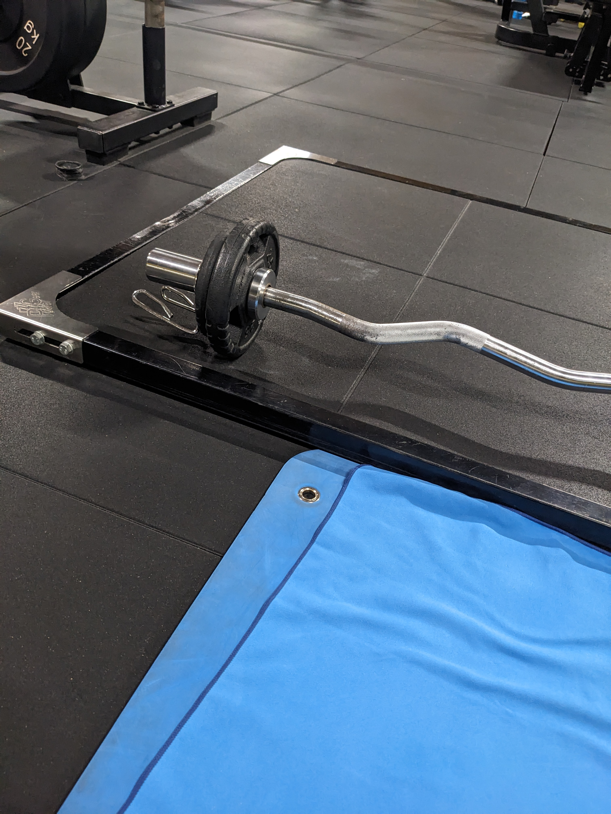

# 2023-11 - B

[[toc]]

Range cedimento consentito -1 o -2

## Sessioni

| #   | Data  |
| --- | ----- |
| 1   | 02-11 |
| 2   | 11-11 |
| 3   | 16-11 |
| 4   | 27-11 |
| 5   | 09-12 |
| 5   | 23-12 |
| 5   | 09-01 |
| 6   |       |
| 7   |       |
| 8   |       |

## Stacco

| #   | 1^                | kg  | 2^          | kg  |
| --- | ----------------- | --- | ----------- | --- |
| 1   | TEST 10RM         | 70  | 3x12 rec 1' | 40  |
| 2   | 3x8 10RM (1'30'') | 70  | 2x12 rec 1' | 40  |
| 3   | 3x8 10RM (1'30'') | 70  | 2x12 rec 1' | 40  |
| 4   | 4x8 10RM (1'30'') | 70  | 2x12 rec 1' | 40  |
| 5   | 4x8 10RM (1'30'') | 70  | 2x12 rec 1' | 40  |
| 5   | 4x8 10RM (1'30'') | 70  | 2x12 rec 1' | 40  |
| 5   | 4x8 10RM (1'30'') | 60  | 2x12 rec 1' | 40  |
| 6   | 5x8 10RM (1'30'') |     | 2x12 rec 1' |     |
| 7   | 5x8 10RM (1'30'') |     | 2x12 rec 1' |     |
| 8   | TEST 10RM         |     | 3x12 rec 1' |     |

### Test 1

1. 60kg 20RM
2. 80kg 6RM
3. 70kg 10RM

nota: il peso include la barra

## RDL manubri

Serie: 5 x 12-10-8-6-12, 1'30'' recupero

| #   | 12  | 10  | 8   | 6   | 12  |
| --- | --- | --- | --- | --- | --- |
| 1   | 30  | 35  | 40  | 45  | 30  |
| 2   | 32  | 36  | 40  | 44  | 32  |
| 3   | 32  | 36  | 44  | 52  | 32  |
| 4   | 32^ | 40  | 44  | 52  | 32  |
| 5   | 28  | 36  | 40  | 40  | 32  |
| 5   | 28  | 36  | 40  | 48  | 32  |
| 5   | 28  | 36  | 44  | 48  | 32  |
| 6   |     |     |     |     |     |
| 7   |     |     |     |     |     |
| 8   |     |     |     |     |     |

## Lat machine triangolo

Serie: 5 x 12-10-8-6-12, 1'30'' recupero

| #   | 12  | 10  | 8     | 6    | 12    |
| --- | --- | --- | ----- | ---- | ----- |
| 1   | 35  | 35  | 40    | 40   | 30    |
| 2   | 35  | 35  | 40    | 40   | 30    |
| 3   | 40  | 45  | 45    | 45   | 40    |
| 4   | 35  | 40  | 40    | 40   | 35    |
| 5   | 35  | 40  | 42.5  | 42.5 | 35    |
| 5   | 40  | 45  | 40    | 45   | 35    |
| 5   | 40  | 40  | 45-40 | 45   | 40-35 |
| 6   |     |     |       |      |       |
| 7   |     |     |       |      |       |
| 8   |     |     |       |      |       |

## Pulldown con trazy bar

Recupero 1'-1'30''.

- Braccio tutto disteso

| #   | serie        | peso |
| --- | ------------ | ---- |
| 1   | 4x10 4'' iso | 12.5 |
| 2   | 4x12 4'' iso | 12.5 |
| 3   | 4x12 4'' iso | 12.5 |
| 4   | 5x10 5'' iso | 12.5 |
| 5   | 5x10 5'' iso | 12.5 |
| 5   | 5x10 5'' iso | 12.5 |
| 5   | 5x10 5'' iso | 12.5 |
| 6   | 5x12 5'' iso |      |
| 7   | 5x12 5'' iso |      |
| 8   | 6x10 6'' iso |      |

## Rear delt fly

Recupero: 1'

- in piedi, accucciato in avanti
- le braccia vanno lateralmente in avanti

| #   | serie | peso |
| --- | ----- | ---- |
| 1   | 3x20  | 4    |
| 2   | 3x20  | 4    |
| 3   | 3x20  | 4    |
| 4   | 4x20  | 4    |
| 5   | 4x20  | 4    |
| 5   | 4x20  | 4    |
| 5   | 4x20  | 4    |
| 6   | 4x20  |      |
| 7   | 4x20  |      |
| 8   | 5x20  |      |

## Hammer curl + floor french press

6xHammer curl + 1' + 6xfloor french press + 1'

### Hammer curl

- Distendi tutto il braccio
- Quando sali col peso, non puntare al petto, punta all'esterno

### Floor french press

- gomiti stretti

| #   | serie | curl | french press | nota           |
| --- | ----- | ---- | ------------ | -------------- |
| 1   | 3     | 20   | 7.5          |                |
| 2   | 3     | 20   | 7.5          | aumenta carico |
| 3   | 3     | 20   | 10           |                |
| 4   | 4     | 20   | 10           |                |
| 5   | 4     | 20   | 10           |                |
| 5   | 4     | 20   | 10           |                |
| 5   | 4     | 20   | 10           |                |
| 6   | 4     |      |              | aumenta carico |
| 7   | 4     |      |              |                |
| 8   | 5     |      |              |                |

## Core

3 giri con 1' recupero

### Reverse crunch su panca x max

### Crunch su panca x max

### Plank x max

## Circuito metabolico (3-4 giri)

- Mezzo Burpees: 30''
- Mountain Climber: 30''
- Spider Plank: max

### Mezzo Burpees

- Partenza come pushup. Appoggia le ginocchia le prime volte.
- Una volta su, dovresti accucciarti portando i piedi sotto le braccia
- Salta, portando le braccia sopra la testa
- Nell'atterraggio, molleggia
- Una volta finito il salto, riparti subito, non fare il passo intermedio

### Spider Plank

- Posizione del plank
- Ruota parzialmente sul fianco
- Apri gamba e anca e sali con la gamba
- Nella salita, la gamba è parallela al terreno
- Se l'esercizio lo sbagli, la posizione sarà più simile a quella del Mountain Climber.
