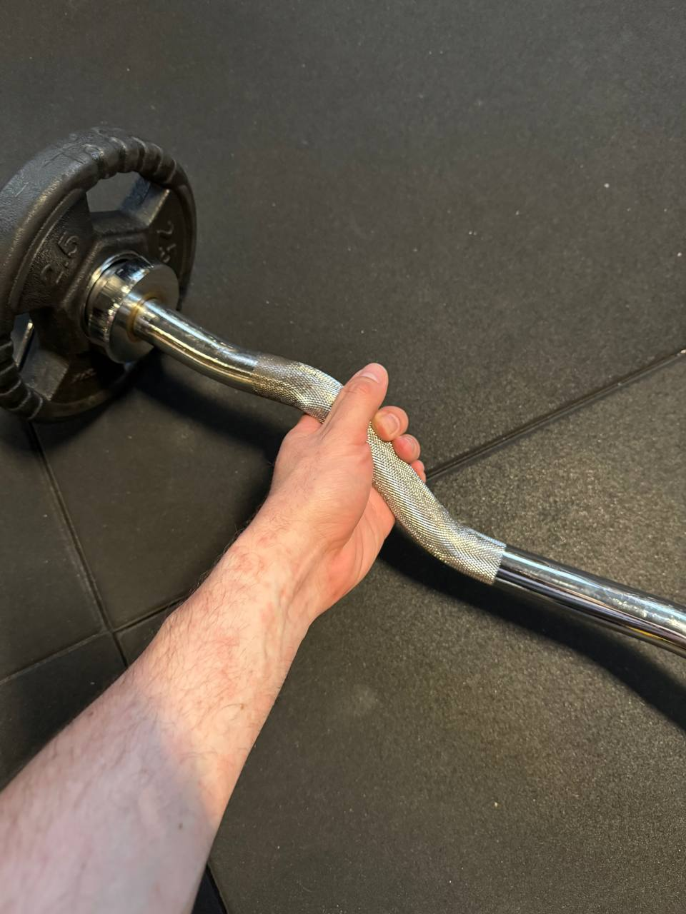

# 2025-05 - A

[[toc]]

## Sessioni

| #   | Data  |
| --- | ----- |
| 1   | 12-05 |
| 2   | 19-05 |
| 3   | 29-05 |
| 4   |       |
| 5   |       |
| 6   |       |
| 7   |       |
| 8   |       |

## Crunch

| #   | Ripetizioni  | Rec. |
| --- | ------------ | ---- |
| 1   | 2x30 -> 2x15 | 30'' |
| 2   | 2x15         | 30'' |
| 3   | 2x15 -> 3x10 | 30'' |
| 4   | 3x10         | 30'' |
| 5   | 3x10         | 30'' |
| 6   | 3x10         | 30'' |
| 7   | 3x10         | 30'' |
| 8   | 3x10         | 30'' |

## Goblet squat

Recupero: 1'30''

- con i manubri sulle spalle
- fallo con una panchetta dietro, scendi, sfiori il culo, risali
- peso sempre sull'avanpiede

| #   | Serie     | Kg  |
| --- | --------- | --- |
| 1   | 3x8 12RM  | 20  |
| 2   | 3x9 12RM  | 20  |
| 3   | 3x9 12RM  | 20  |
| 4   | 3x9 12RM  |     |
| 5   | 3x10 12RM |     |
| 6   | 3x10 12RM |     |
| 7   | 3x10 12RM |     |
| 8   | 3x11 12RM |     |

Nota: peso totale

## Lat machine

Recupero: 1'30''

- giù le spalle
- gomiti in avanti

| #   | Serie     | Kg  |
| --- | --------- | --- |
| 1   | 3x8 12RM  | 45  |
| 2   | 3x9 12RM  | 45  |
| 3   | 3x9 12RM  | 50  |
| 4   | 3x9 12RM  |     |
| 5   | 3x10 12RM |     |
| 6   | 3x10 12RM |     |
| 7   | 3x10 12RM |     |
| 8   | 3x11 12RM |     |

## Chest press PURE

Recupero: 1'30''

| #   | Serie     | Kg  |
| --- | --------- | --- |
| 1   | 3x8 12RM  | 45  |
| 2   | 3x9 12RM  | 45  |
| 3   | 3x9 12RM  | 45  |
| 4   | 3x9 12RM  |     |
| 5   | 3x10 12RM |     |
| 6   | 3x10 12RM |     |
| 7   | 3x10 12RM |     |
| 8   | 3x11 12RM |     |

Nota: peso totale

## Low row PURE

Recupero: 1'30''

- fai l'esercizio più lentamente

| #   | Serie     | Kg  |
| --- | --------- | --- |
| 1   | 3x8 12RM  | 30  |
| 2   | 3x9 12RM  | 40  |
| 3   | 3x9 12RM  | 40  |
| 4   | 3x9 12RM  |     |
| 5   | 3x10 12RM |     |
| 6   | 3x10 12RM |     |
| 7   | 3x10 12RM |     |
| 8   | 3x11 12RM |     |

Nota: peso totale

## Curl EZ

Recupero: 1'30''-2'

- apertura larga
- braccio disteso
- gomito appoggiato al fianco, non si deve muovere

| #   | Serie    | Kg  |
| --- | -------- | --- |
| 1   | 4x8 10RM | 5   |
| 2   | 4x9 10RM | 5   |
| 3   | 4x9 10RM | 5   |
| 4   | 4x9 10RM |     |
| 5   | 4x8 10RM |     |
| 6   | 4x8 10RM |     |
| 7   | 4x9 10RM |     |
| 8   | 4x9 10RM |     |

Nota: peso totale

## French Manubri

Recupero: 1'

| #   | Serie    | Kg  |
| --- | -------- | --- |
| 1   | 3x12     | 12  |
| 2   | 13-12-12 | 12  |
| 3   | 13-12-12 | 12  |
| 4   | 13-12-12 |     |
| 5   | 13-13-12 |     |
| 6   | 13-13-12 |     |
| 7   | 13-13-12 |     |
| 8   | 3x13     |     |

Nota: peso totale

## Cardio

Cardio LISS 20'
